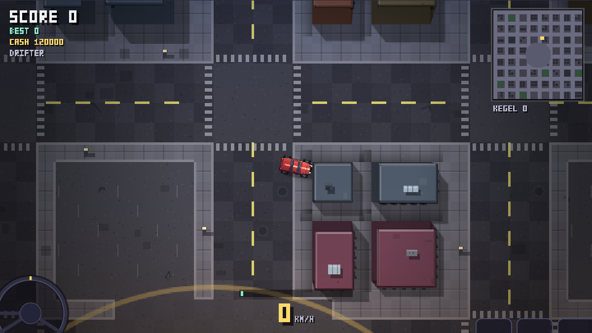
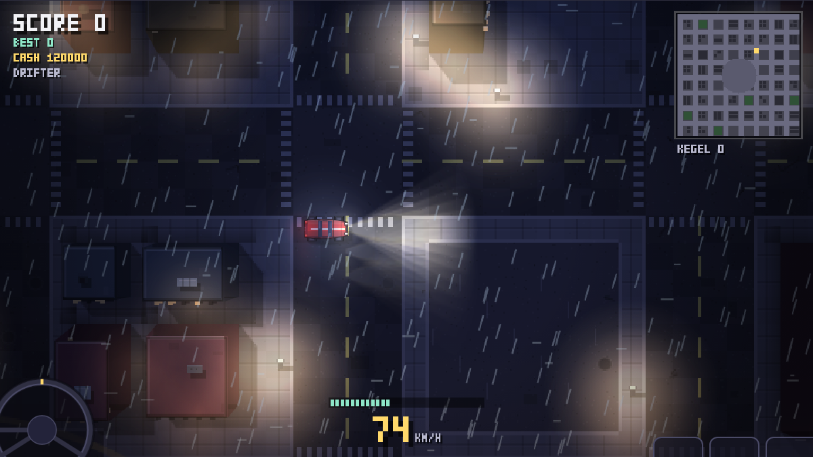
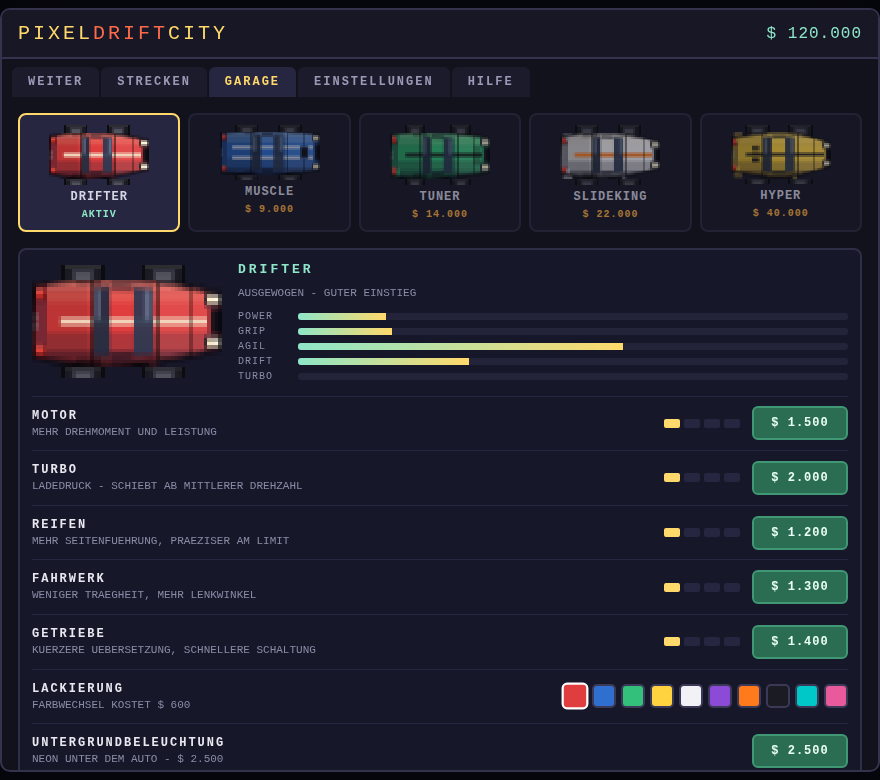

# PIXEL DRIFT CITY

**▶ Jetzt spielen: https://levithomas15.github.io/2d-autorennen/**

Ein Top-Down-Drift-Simulator im Stil von GTA 1/2 – Vogelperspektive, Pixel-Optik,
sechs prozedural erzeugte Strecken, Lenkrad, Pedale und optionale Gangschaltung.

Reines HTML5 + Canvas + ES-Module. Keine Abhängigkeiten, kein Build-Schritt.



| Regen bei Nacht | Garage |
| --- | --- |
|  |  |

## Starten

Online läuft es unter der Adresse oben. Lokal:

```bash
# irgendein statischer Server (ES-Module brauchen http://, file:// reicht nicht)
npx http-server -p 8080 .
# dann http://localhost:8080 öffnen
```

## Veröffentlichen

`.github/workflows/pages.yml` stellt die Seite bei jedem Push auf den
Standard-Branch zusammen und veröffentlicht sie über GitHub Pages. Kopiert
werden nur `index.html`, `style.css`, `src/` und `media/`.

**Einmalig nötig:** unter *Settings → Pages → Build and deployment* als *Source*
**GitHub Actions** auswählen. Ohne diese Einstellung darf der Workflow die
Pages-Seite nicht selbst anlegen (`Resource not accessible by integration`).
Danach unter *Actions → GitHub Pages → Run workflow* einmal starten – alle
weiteren Pushes veröffentlichen automatisch.

Eigene Domain: eine Datei `CNAME` mit dem Hostnamen (z. B. `drift.example.com`)
im Repo-Wurzelverzeichnis anlegen – der Workflow übernimmt sie automatisch.
Beim Domain-Anbieter zusätzlich einen CNAME-Eintrag auf
`levithomas15.github.io` setzen.

Wird der Standard-Branch später umbenannt oder auf `main` gewechselt, muss der
Branch-Name in `.github/workflows/pages.yml` unter `on.push.branches`
mitgeändert werden.

## Steuerung

| Eingabe | Funktion |
| --- | --- |
| `W` / `↑` | Gas |
| `S` / `↓` | Bremse, im Stand rückwärts |
| `A` `D` / `←` `→` | Lenken |
| `Leertaste` | Handbremse – leitet den Drift ein |
| `E` / `Shift` | Hochschalten (bei manueller Schaltung) |
| `Q` / `Strg` | Runterschalten |
| `F` | Kupplung (wenn aktiviert) |
| `R` | Auto zurücksetzen |
| `C` | Auto wechseln |
| `M` | Sound an/aus |
| `N` | Strecke wechseln |
| `K` | Reifenspuren löschen |
| `Esc` / `P` | Menü |

Bedienelemente auf dem Bildschirm: **Lenkrad** unten links (mit Maus oder Finger
drehen, der farbige Ring zeigt den Driftwinkel), **Pedale** unten rechts
(Gas, Bremse, Handbremse und – wenn aktiviert – Kupplung) und der
**Schalthebel**, der sich nach oben oder unten ziehen lässt. Jedes Element lässt
sich in den Einstellungen ausblenden.

## Gangschaltung

In den Einstellungen unter *Steuerung* in drei Stufen:

* **AUS** – Arcade, keine Gänge, leistungsbegrenzte Schubkraft.
* **AUTOMATIK** – Getriebe wird simuliert und schaltet selbst, Rückwärtsgang
  legt sich im Stand beim Bremsen ein.
* **MANUELL** – du schaltest selbst, optional mit Kupplungszwang.

Simuliert werden Drehmomentkurve, Drehzahlbegrenzer, Motorbremse,
Turbo mit Ladedruckaufbau und die einzelnen Übersetzungen. Das HUD zeigt dann
Gang, Drehzahlband und Ladedruck.

## Strecken

Sechs Karten, jederzeit im Menü unter *Strecken* oder mit `N` umschaltbar.
Die Auswahl wird gespeichert.

| Strecke | Größe | Charakter |
| --- | --- | --- |
| INNENSTADT | 104×104 | dichtes Straßenraster mit Drift-Arena in der Mitte |
| HAFENVIERTEL | 120×104 | weite Kaiflächen, Lagerhallen, Wasser ringsum |
| BERGPASS | 88×136 | enge Serpentinen mit Kehren und Gipfelplateau |
| INDUSTRIEPARK | 112×112 | riesige Asphaltflächen, Hallen, Kreisverkehr, Teststrecke |
| DRIFT-STADION | 88×88 | reine Spielwiese: Acht, Kreisel, Eisflächen |
| WINTERSTADT | 96×96 | verschneite Stadt mit Eisplatten, wenig Grip |

Der Untergrund zählt in der Physik mit – Asphalt und Beton greifen voll,
Schotter und Schnee deutlich weniger, Sand bremst stark und Eis hat fast
keinen Grip. Wasser, Fels, Gebäude und Banden sind fest.

## Garage

Fünf Fahrzeuge mit eigenem Charakter:

| Auto | Preis | Charakter |
| --- | --- | --- |
| DRIFTER | frei | ausgewogen, guter Einstieg |
| MUSCLE | 9.000 | schwer, brutales Drehmoment |
| TUNER | 14.000 | leicht, drehfreudig, direkt |
| SLIDEKING | 22.000 | Heck kommt von allein |
| HYPER | 40.000 | extrem schnell, viel Grip |

Getunt wird in fünf Kategorien mit je vier Stufen – **Motor**, **Turbo**,
**Reifen**, **Fahrwerk**, **Getriebe** – dazu **Lackierung** aus zehn Farben und
die **Untergrundbeleuchtung** (Neon in sechs Farben, optional pulsierend).
Bezahlt wird mit Geld aus Drifts: Jeder sauber beendete Drift bringt so viel
Geld wie Punkte, Pylonen geben extra. Besitz, Tuning und Geld bleiben im
localStorage gespeichert.

## Einstellungen

* **Steuerung** – Gangschaltung, Kupplung, Lenkrad-Empfindlichkeit und
  -Rückstellung, Sichtbarkeit von Lenkrad und Pedalen.
* **Fahrverhalten** – Drift-Intensität, Gegenlenk-Hilfe,
  Stabilitätskontrolle, Gesamt-Grip, Auto-Reset beim Festfahren.
* **Optik** – Gebäudehöhe (3D), Wetter, Farbstimmung,
  Tageszeit (Tag/Abend/Nacht), Laternen und Fenster, Lichtschein,
  Untergrundbeleuchtung, Neon-Pulsieren, Reifenspuren und deren Verblassen,
  Partikelmenge, Bildschütteln, Vignette, Scanlines, Minimap, Scheinwerfer,
  Kamera-Zoom.
* **Audio** – Gesamtlautstärke, Motor, Reifen.

Alles wirkt sofort und wird gespeichert.

## So driftet man

1. Auf 60–100 km/h beschleunigen.
2. Einlenken und kurz die Handbremse antippen – das Heck bricht aus.
3. Handbremse loslassen, Gas halten und **gegenlenken**.
4. Den Drift mit kleinen Lenkkorrekturen halten: Der Multiplikator steigt alle
   1,6 Sekunden um eine Stufe (bis x10). Punkte gibt es erst beim sauberen
   Beenden – ein Crash kostet den ganzen Combo.

Die große Arena in der Kartenmitte ist zum freien Üben da, die Parkplätze in der
Stadt eignen sich für Donuts.

## Grafik

Alles ist prozedural gezeichnet, kein einziges Bild-Asset.

**Häuser mit Höhe**: Jedes Gebäude hat eine eigene Höhe, und die Wände neigen
sich pro Bild von der Bildmitte weg – derselbe Trick, mit dem GTA 2 seine Stadt
räumlich wirken lässt. Die Dachflächen liegen als eigene Ebene bereit und werden
nur versetzt kopiert, die Wände samt Fensterrastern entstehen pro Bild aus
wenigen Flächen. Dazu Sockelverschattung, Schlagschatten auf die Straße und
weiche Verschattung rund um den Grundriss. Stärke einstellbar über
*Gebäudehöhe (3D)*; hohe Wände verdecken das Auto genau wie im Vorbild.

**Wetter**: Klar, Regen oder Schnee. Regen zeichnet Schlieren und Aufschläge,
Schnee taumelnde Flocken. Bei Regen wird die Lichtebene nach unten verzogen
noch einmal additiv aufgelegt – das liest sich wie Spiegelungen im Wasserfilm.
Beides zählt in der Physik mit: Regen kostet 14 % Grip, Schnee 26 %.

**Farbstimmung**: Ein abschließender Durchgang legt kühle Schatten oben und
warme Lichter unten übereinander, das trennt die Bildebenen sichtbar.

**Dynamisches Licht** (`src/light.js`): Ab Tageszeit *Abend* wird pro Bild eine
Lichtkarte in Bildschirmgröße aufgebaut und über die Szene multipliziert.
Lichtquellen sind Straßenlaternen, erleuchtete Fenster, Flutlichtmasten,
Antennenbefeuerung, die Scheinwerfer (weicher Kegel aus mehreren Keilen),
Bremslichter und das Neon unter dem Auto. Lichter und Umgebungslicht liegen auf
getrennten Ebenen – nur die Lichtebene wird additiv als Schein darübergelegt,
damit der Schein die dunklen Flächen nicht flach aufhellt.

**Auflösung**: Die Szene wird mit doppelter Auflösung gezeichnet (960 × 540
statt 480 × 270). Die Kacheln der Welt bleiben dadurch gleich grob, aber
Fahrzeuge, Hindernisse, Licht und Niederschlag haben doppelt so viele
Bildpunkte zur Verfügung.

**Fahrzeuge**: Der Umriss entsteht als Pfad aus einem Breitenprofil je Modell –
vom kantigen MUSCLE bis zum keilförmigen HYPER – und wird in klaren Farbstufen
schattiert statt mit weichen Verläufen, damit das Bild scharf bleibt. Licht- und
Schattentöne sind dabei farbverschoben (warm aufhellen, kühl abdunkeln); reines
Weiß lässt rote Lacke sonst rosa wirken. Dazu Front- und Heckscheibe mit
Spiegelstreifen, Seitenscheiben, durchlaufende Zierstreifen unter dem Glas,
Türfugen, Radhäuser, Außenspiegel, Stoßfänger mit Grill, Scheinwerfer und
Rückleuchten mit Gehäuse, Auspuffendrohre sowie modellabhängige Details:
Hutze beim MUSCLE, Lufteinlässe beim HYPER, breite Kotflügel beim SLIDEKING,
Heckflügel mit Stützen bei den getunten Modellen. Umgeben von einer dunklen
Kontur für klare Silhouette, darunter ein weicher Schlagschatten aus mehreren
versetzten Kopien. Die vier Räder sind eigene Sprites mit Reifenflanke und
Felge, die vorderen lenken mit, beim Durchdrehen verwischt die Felge.
Bremslichter leuchten beim Bremsen auf.

**Umgebung**: Asphalt bekommt Körnung, Risse, Flicken und Kanaldeckel,
Bürgersteige Plattenfugen, Parkflächen Stellplatzmarkierungen, Wasser
Wellenkämme, Eis Glanzstreifen. Gebäude werden mit sichtbarer Süd- und Ostwand
extrudiert, bekommen Fensterreihen (ein Teil beleuchtet) und Dachaufbauten:
Lüftungsgeräte, Oberlichter, Treppenhäuser, Wassertanks und Antennen – jeweils
mit eigenem Schatten in einheitlicher Lichtrichtung. Dazu Straßenlaternen und
Bäume.

**Effekte**: Reifenspuren aus breitem Abrieb mit dunklem Kern, Rauch als weiche
Wolken statt Quadrate, Funken beim Aufprall, Staub in der Farbe des Untergrunds,
wandernde Wellenkämme auf dem Wasser. Pylonen und Fässer sind plastisch
schattiert und liegen umgefahren flach auf der Straße.

## Fahrphysik

`src/car.js` rechnet mit einem vereinfachten Schräglaufwinkel-Modell:

* Längs- und Querbewegung werden im Fahrzeugkoordinatensystem getrennt geführt.
* Für Vorder- und Hinterachse wird je ein Schräglaufwinkel bestimmt, daraus
  folgt die Seitenkraft und aus deren Differenz das Giermoment.
* Die Seitenkraft fällt hinter dem Haftungsmaximum wieder ab – dieser Abfall
  ist der Grund, warum sich ein Drift überhaupt halten lässt. Die
  Drift-Intensität aus den Einstellungen steuert genau diesen Abfall.
* Gas und Handbremse reduzieren die Haftung der Hinterachse gezielt
  (Power-Oversteer bzw. Drift-Einleitung).
* Untergrund zählt mit: Asphalt greift voll, Gras rutscht deutlich mehr.
* Bei Wandkontakt wird die Geschwindigkeit in Normal- und Tangentialanteil
  zerlegt, das Auto schrammt entlang statt hängenzubleiben.

## Aufbau

| Datei | Inhalt |
| --- | --- |
| `index.html` | Seite, Bedienelemente, Menü-Gerüst |
| `style.css` | Layout, Pixel-Skalierung, Menü und Bedienelemente |
| `src/main.js` | Spielschleife, Kamera, Wertung, HUD, Partikel, Effekte |
| `src/car.js` | Fahrwerksphysik, Kollision, Fahrzeug-Sprites |
| `src/drivetrain.js` | Drehmomentkurve, Turbo, Getriebe, Automatik |
| `src/cars.js` | Fahrzeugdaten, Tuning-Stufen, effektive Fahrwerte |
| `src/garage.js` | Geld, Besitz und Tuning-Stand (localStorage) |
| `src/settings.js` | Einstellungs-Schema, Standardwerte, Speicherung |
| `src/ui.js` | Menü: Start, Garage, Einstellungen, Hilfe |
| `src/world.js` | Kacheln, Bau-Werkzeuge, Vorab-Rendering, Kollisionsgeometrie |
| `src/maps.js` | die sechs Karten und ihre Generatoren |
| `src/input.js` | Tastatur, Lenkrad, Pedale, Schalthebel |
| `src/light.js` | Dynamische Beleuchtung, Lichtkarte und Schein |
| `src/audio.js` | Prozeduraler Motor-, Reifen- und Crash-Sound |
| `src/font.js` | 3×5-Pixel-Font fürs HUD |
| `.github/workflows/pages.yml` | Veröffentlichung auf GitHub Pages |

Jede Karte wird aus einem festen Seed erzeugt und einmalig auf ein
Offscreen-Canvas gerendert; pro Frame wird nur der sichtbare Ausschnitt kopiert.
Für die Vorschaubilder im Menü werden die Karten im Modus `tilesOnly` gebaut –
also nur die Kacheldaten, ohne das teure Rendering.
Reifenspuren liegen auf einer zweiten Ebene in Weltgröße und verblassen langsam.

Interne Auflösung: 480 × 270, hochskaliert ohne Glättung – daher die harten Pixel.
